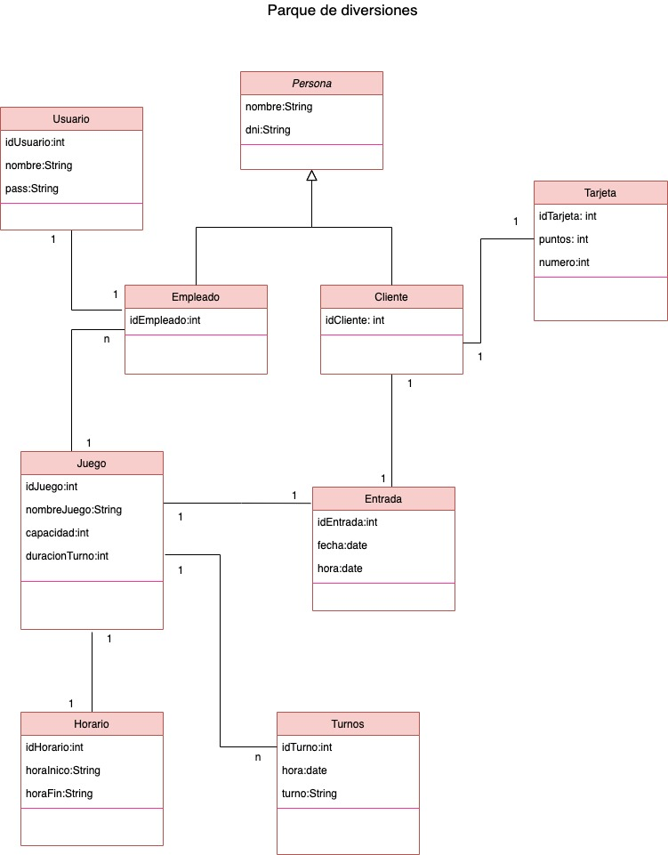

# javaWeb-jsp

Trabajo Practico Final del curso de Desarrollo Web dictado por Polo Tic Misiones.
La aplicación realizada en Java tiene las funcionalidades crud de Empleados, Juegos y 
venta de Entradas de un parque de diversiones.

Realizado en IDE Netbeans 8, utilizando Boostrap en el Frontend, y en el Backend
JSP, Servlets y JPA.

